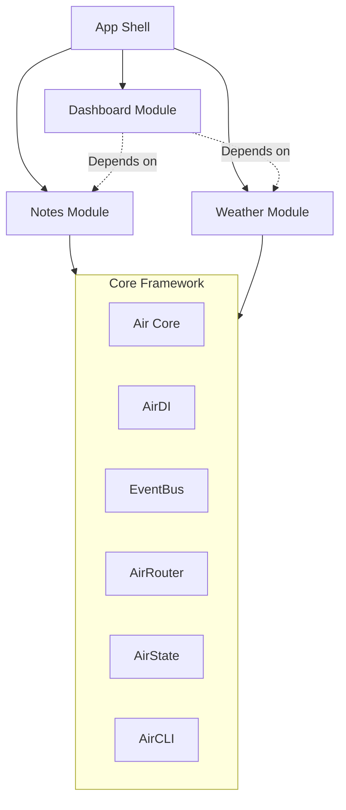

# Air Framework 🚀

[](https://pub.dev/packages/air_framework)
[](https://opensource.org/licenses/MIT)
[](https://pub.dev/packages/flutter_lints)

A **modular**, **reactive**, and **scalable** framework for Flutter. Build industrial-grade apps with a decoupled architecture inspired by enterprise app concepts.

> **Why Air Framework?**
>
> As apps grow, they become harder to maintain. Air Framework solves this by enforcing **strict module boundaries**, **unidirectional data flow**, and **explicit dependencies**. It's not just a state management library; it's a complete architecture for teams building large-scale Flutter applications.

---

## ✨ Features

| Feature                     | Description                                                             |
| --------------------------- | ----------------------------------------------------------------------- |
| 🧩 **Modular Architecture** | Self-contained, independent modules with clear boundaries               |
| ⚡ **Reactive State**       | Built-in state management using `Air State` controller with typed flows |
| 💉 **Dependency Injection** | Type-safe DI with scoped services and lifecycle management              |
| 🔒 **Security**             | Permission system, secure logging, and audit trails                     |
| 🛣️ **Routing**              | Integrated routing with `go_router` support                             |
| 🛠️ **DevTools**             | Built-in debugging panels for state, modules, and performance           |

| 🧪 **Testing Utilities** | Mock controllers and test helpers included |

---

## 🏗️ Architecture

Every feature is a **Module**. Modules declare their dependencies explicitly and communicate via a typed **Event Bus**.



---

## 📦 Installation

Add `air_framework` to your `pubspec.yaml`:

```yaml
dependencies:
  air_framework: ^1.0.0
```

For the complete development experience, also install the CLI:

```bash
dart pub global activate air_cli
```

---

## 🚀 Quick Start

### 1. Create a Module

Define a module by extending `AppModule`. This encapsulates your routes, bindings, and initialization logic.

```dart
import 'package:air_framework/air_framework.dart';

class CounterModule extends AppModule {
  @override
  String get id => 'counter';

  @override
  List<AirRoute> get routes => [
    AirRoute(
      path: '/counter',
      builder: (context, state) => const CounterPage(),
    ),
  ];

  @override
  void onBind(AirDI di) {
    // Register dependencies lazily
    di.registerLazySingleton<CounterState>(() => CounterState());
  }
}
```

### 2. Define State

Use the `@GenerateState` annotation to **magically** generate reactive `Flows` and `Pulses`.

Simply modify fields like a standard Dart class (e.g. `count++`), and the framework **automatically detects the change** and updates only the widgets listening to that value. No boilerplate, no `notifyListeners()`—just pure logic.

```dart
import 'package:air_framework/air_framework.dart';

part 'state.air.g.dart';

@GenerateState('counter')
class CounterState extends _CounterState {
  // Private fields become reactive StateFlows
  int _count = 0;

  // Public methods become dispatchable Pulses
  @override
  void increment() {
    count++;
  }
}
```

### 3. Build Reactive UI

Use `AirView` to listen to state changes efficiently. It automatically tracks which flows are accessed and rebuilds only when necessary.

```dart
class CounterPage extends StatelessWidget {
  @override
  Widget build(BuildContext context) {
    return Scaffold(
      body: Center(
        child: AirView((context) {
          // Auto-subscribes to 'count'
          return Text('Count: ${CounterFlows.count.value}');
        }),
      ),
      floatingActionButton: FloatingActionButton(
        // Triggers the 'increment' pulse
        onPressed: () => CounterPulses.increment.pulse(null),
        child: const Icon(Icons.add),
      ),
    );
  }
}
```

### 4. Initialize Your App

Register your modules in `main.dart`.

```dart
void main() async {
  WidgetsFlutterBinding.ensureInitialized();

  // 1. Configure Air State
  configureAirState();

  // 2. Register Modules
  await ModuleManager().register(CounterModule());
  // await ModuleManager().register(AuthModule());

  runApp(const MyApp());
}

class MyApp extends StatelessWidget {
  const MyApp({super.key});

  @override
  Widget build(BuildContext context) {
    return MaterialApp.router(
      title: 'Air App',
      routerConfig: AirRouter().router,
    );
  }
}
```

---

## 🔧 CLI Tools

The **Air CLI** allows you to scaffold modules and generate state files instantly.

```bash
# Create a new project
air create my_app --template=starter

# Generate a new module
air generate module inventory

# Generate state code (run inside a module directory)
air generate state
```

---

## 📚 Related Packages

| Package                                                 | Description                   |
| ------------------------------------------------------- | ----------------------------- |
| [air_cli](https://pub.dev/packages/air_cli)             | Command-line scaffolding tool |
| [air_state](https://pub.dev/packages/air_state)         | Core reactive state package   |
| [air_generator](https://pub.dev/packages/air_generator) | Build runner code generation  |

---

## 🤝 Contributing

Contributions are welcome! Please read our [contributing guidelines](https://github.com/AndreyDAraya/air-framework/blob/main/CONTRIBUTING.md) first.

## 📄 License

This project is licensed under the MIT License - see the [LICENSE](LICENSE) file for details.

---

Made by [Andrey D. Araya](https://github.com/AndreyDAraya)
