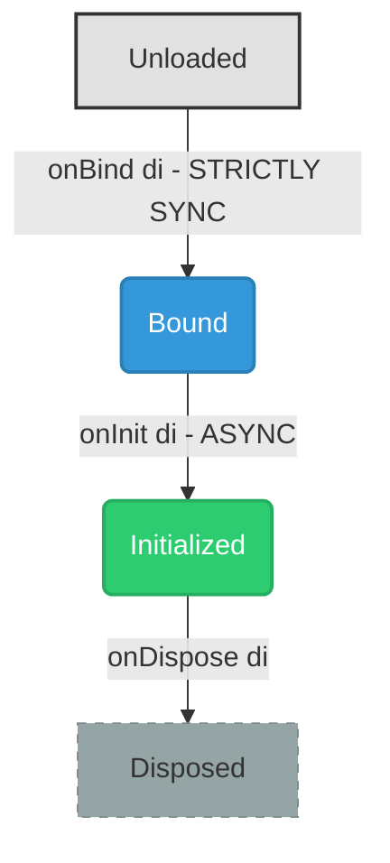

# Air Framework - Developer Guide

A modular, reactive, and scalable framework for Flutter. Build industrial-grade apps with a decoupled architecture.

---

## Table of Contents

1. [Getting Started](#getting-started)
2. [Core Concepts](#core-concepts)
3. [Modules](#modules)
4. [Dependency Injection](#dependency-injection)
5. [Inter-Module Communication](#inter-module-communication)
6. [Security](#security)
7. [Routing](#routing)
8. [State Management](#state-management)
9. [Best Practices](#best-practices)

---

## Getting Started

### Installation

Add to your `pubspec.yaml`:

```yaml
dependencies:
  air_framework: ^1.0.0
```

### Basic Setup

```dart
import 'package:flutter/material.dart';
import 'package:air_framework/air_framework.dart';

void main() async {
  WidgetsFlutterBinding.ensureInitialized();

  // Configure Air State
  configureAirState();

  // Register modules
  await ModuleManager().register(AuthModule());
  await ModuleManager().register(HomeModule());

  runApp(MyApp());
}

class MyApp extends StatelessWidget {
  @override
  Widget build(BuildContext context) {
    return MaterialApp.router(
      routerConfig: AirRouter().router,
    );
  }
}
```

---

## Core Concepts

Air Framework is built around these core principles:

| Concept                  | Description                                                                 |
| ------------------------ | --------------------------------------------------------------------------- |
| **Modules**              | Self-contained feature units with their own routes, services, and lifecycle |
| **Dependency Injection** | Centralized service locator for managing dependencies                       |
| **Event Bus**            | Publish-subscribe system for decoupled communication                        |
| **Security**             | Permission-based access control and audit logging                           |

---

## Modules

### Creating a Module

Every feature in Air Framework is encapsulated in a module. Extend `AppModule`:

```dart
import 'package:air_framework/air_framework.dart';

class AuthModule extends AppModule {
  @override
  String get id => 'auth';

  @override
  String get name => 'Authentication';

  @override
  String get version => '1.0.0';

  @override
  String get initialRoute => '/login';

  @override
  List<AirRoute> get routes => [
    AirRoute(
      path: '/login',
      builder: (context, state) => LoginView(),
    ),
    AirRoute(
      path: '/register',
      builder: (context, state) => RegisterView(),
    ),
  ];

  @override
  List<String> get dependencies => [
    'core:^1.0.0', // Mandatory dependency with semver
    'database',    // Mandatory dependency without version
  ];

  @override
  List<String> get optionalDependencies => ['analytics'];

  @override
  void onBind(AirDI di) {
    // 1. Sync Configuration & Registration ONLY
    // We register the service, but it's not "ready" yet.
    di.registerLazySingleton<StorageService>(() => StorageServiceImpl());
    di.registerLazySingleton<AuthService>(() => AuthServiceImpl());
  }

  @override
  Future<void> onInit(AirDI di) async {
    // 2. Async Heavy Lifting & Preparation
    // This is the correct place to initialize SharedPreferences or Databases
    final storage = di.get<StorageService>();
    await storage.init(); // e.g., await SharedPreferences.getInstance()

    final authService = di.get<AuthService>();
    await authService.checkSession();
  }

  @override
  Future<void> onDispose(AirDI di) async {
    // Cleanup when module is unregistered
    di.unregisterModule(id);
  }

  @override
  void onError(Object error, StackTrace stackTrace) {
    // Handle module-specific errors
    print('Auth error: $error');
  }
}
```

### Module Lifecycle



### Dependency Versioning

The `dependencies` list supports Semantic Versioning (semver).

- **Syntax:** `'module_id:version_requirement'` (e.g., `'auth:^1.2.0'`).
- **Missing Dependency:** Throws a `StateError` (Execution blocked).
- **Version Mismatch:** Displays a **Yellow Warning** in the console but allows execution for flexibility.

### Colored Console Logs

The framework uses ANSI colors in the console to highlight important module-related messages:

- `[ModuleManager] Warning`: Displayed in **Yellow** for version mismatches or duplicate routes.
- `[ModuleManager] Info`: Displayed in **Yellow** for missing optional dependencies.

### Managing Modules

```dart
// Register a module
await ModuleManager().register(AuthModule());

// Check if registered
bool isRegistered = ModuleManager().isRegistered('auth');

// Get a module
AppModule? authModule = ModuleManager().getModule('auth');

// Get module context (for accessing framework services)
ModuleContext? context = ModuleManager().getContext('auth');

// Unregister (fails if other modules depend on it)
await ModuleManager().unregister('auth');

// Get all routes from all modules
List<AirRoute> routes = ModuleManager().getAirRoutes();
```

---

## Dependency Injection

Air Framework provides `AirDI`, a lightweight service locator.

### Registration Types

```dart
// 1. Singleton - immediate instance
AirDI().register<UserService>(UserServiceImpl(), moduleId: 'user');

// 2. Lazy Singleton - created on first access
AirDI().registerLazySingleton<ApiClient>(() => ApiClient());

// 3. Factory - new instance every time
AirDI().registerFactory<Logger>(() => Logger());

// Overwriting protection
// By default, trying to register the same type twice throws an exception.
// Set allowOverwrite to true to explicitly replace a dependency (common in testing).
AirDI().register<AuthService>(MockAuth(), allowOverwrite: true);
```

### Retrieving Dependencies

```dart
// Get (throws if not found)
final userService = AirDI().get<UserService>();

// TryGet (returns null if not found)
final analytics = AirDI().tryGet<AnalyticsService>();

// Check if registered
bool hasLogger = AirDI().isRegistered<Logger>();
```

### Module Ownership

```dart
// Register with module ownership
AirDI().register<PaymentService>(
  PaymentServiceImpl(),
  moduleId: 'payments',
);

// Get owner
String? owner = AirDI().getOwner<PaymentService>(); // 'payments'

// Unregister (only owner can unregister)
bool success = AirDI().unregister<PaymentService>(callerModuleId: 'payments');

// Unregister all from a module
AirDI().unregisterModule('payments');
```

### Debugging

```dart
// List all registered types
List<String> types = AirDI().debugRegisteredTypes;

// Get registration info with owners
Map<String, String?> info = AirDI().debugRegistrationInfo;
```

---

## Inter-Module Communication

### EventBus - Typed Events

For strongly-typed event communication:

```dart
// 1. Define an event
class UserLoggedInEvent extends ModuleEvent {
  final String userId;
  final String email;

  UserLoggedInEvent({
    required super.sourceModuleId,
    required this.userId,
    required this.email,
  });
}

// 2. Subscribe to events
final subscription = EventBus().on<UserLoggedInEvent>((event) {
  print('User ${event.email} logged in from ${event.sourceModuleId}');
}, subscriberModuleId: 'home');

// 3. Emit events
EventBus().emit(UserLoggedInEvent(
  sourceModuleId: 'auth',
  userId: '123',
  email: 'user@example.com',
));

// 4. Cancel subscription
EventBus().cancel(subscription);

// Cancel all subscriptions from a module
EventBus().cancelModuleSubscriptions('home');
```

### EventBus - Named Signals

For lightweight, dynamic communication:

```dart
// Subscribe to a signal
EventBus().onSignal('cart.updated', (data) {
  final items = data as List<CartItem>;
  print('Cart has ${items.length} items');
}, subscriberModuleId: 'checkout');

// Emit a signal
EventBus().emitSignal(
  'cart.updated',
  data: [CartItem('Product A', 29.99)],
  sourceModuleId: 'cart',
);
```

### EventBus - Async & History

```dart
// Emit asynchronously
await EventBus().emitAsync(MyEvent(sourceModuleId: 'source'));

// Get event history
List<ModuleEvent> history = EventBus().eventHistory;
List<SignalRecord> signalHistory = EventBus().signalHistory;

// Get recent events of type
List<UserLoggedInEvent> recentLogins = EventBus().getRecentEvents<UserLoggedInEvent>();
```

### EventBus - Middleware

```dart
// Add event middleware (logging, validation, etc.)
EventBus().addMiddleware((event, next) {
  print('Event emitted: ${event.runtimeType}');
  next(event); // Continue chain
});

// Add signal middleware
EventBus().addSignalMiddleware((name, data, next) {
  if (name.startsWith('private.')) {
    print('Warning: private signal');
  }
  next(name, data);
});
```

### Schema Validation

Validate event and signal data:

```dart
// Register a schema for signals
EventSchemaValidator().registerSignalSchema(
  'user.register',
  MapSchema({
    'email': StringSchema(required: true, pattern: r'^[\w-\.]+@[\w-]+\.[\w-]{2,4}$'),
    'password': StringSchema(required: true, minLength: 8),
    'age': NumberSchema(min: 18),
  }),
);

// Validate before emitting
final result = EventSchemaValidator().validateSignal('user.register', {
  'email': 'test@example.com',
  'password': 'securepass123',
  'age': 25,
});

if (result.isValid) {
  EventBus().emitSignal('user.register', data: userData);
} else {
  print('Validation errors: ${result.errors}');
}
```

---

## Security

### Permissions

Define and check module permissions:

```dart
// Define module permissions
const authPermissions = ModulePermissions([
  ScopedPermission(Permission.dataRead),
  ScopedPermission(Permission.dataWrite, 'user.*'),
  ScopedPermission(Permission.serviceCall, 'auth.*'),
  ScopedPermission(Permission.eventEmit),
]);

// Register permissions
PermissionChecker().registerModule('auth', authPermissions);

// Check permission
bool canRead = PermissionChecker().checkPermission(
  'auth',
  Permission.dataRead,
  resource: 'user.profile',
);

// Require permission (throws if denied)
PermissionChecker().requirePermission(
  'auth',
  Permission.serviceCall,
  resource: 'auth.login',
);
```

### Enforcement Modes

### Enforcement Modes

The permission system is designed to be **Opt-In** to avoid friction during early development, while providing robust security for large-scale applications.

1.  **Debug Mode (Default)**: Permissions are checked, but violations only result in a **Yellow Console Warning**. The action is permitted to proceed. This allows rapid prototyping without configuration overhead.
2.  **Release Mode**: By default, remains permissive unless configured otherwise.
3.  **Strict Mode (Opt-In)**: Recommended for **Production**, **Enterprise Apps**, or **Plugin Architectures**.

    When enabled, the framework acts as a security enforcement point, blocking any unauthorized access between modules. This is critical when:
    - Multiple teams work on different modules.
    - Third-party modules are loaded dynamically.
    - Handling sensitive data (Financial/Health).

    To enable Strict Mode, add this to your `main.dart`:

    ```dart
    // Force strict permission checks (throws exception on violation)
    PermissionChecker().enable();
    ```

### Permission Types

| Permission    | Description              |
| ------------- | ------------------------ |
| `dataRead`    | Read shared state keys   |
| `dataWrite`   | Update shared state keys |
| `serviceCall` | Call registered services |
| `eventEmit`   | Emit events on EventBus  |
| `eventListen` | Subscribe to events      |
| `routeAccess` | Navigate to routes       |
| `fullAccess`  | All permissions          |

### Secure Service Registry

Register services with access control:

```dart
// Register a public service
SecureServiceRegistry().registerService(
  name: 'analytics.track',
  ownerModuleId: 'analytics',
  service: (String event, Map<String, dynamic> data) {
    // Track event
  },
);

// Register a restricted service
SecureServiceRegistry().registerService(
  name: 'payments.process',
  ownerModuleId: 'payments',
  service: (double amount) async {
    // Process payment
  },
  allowedCallers: ['checkout', 'subscriptions'],
);

// Get service (returns null if not authorized)
final trackFn = SecureServiceRegistry().getService<Function>(
  'analytics.track',
  callerModuleId: 'home',
);

// Store secure data with TTL
SecureServiceRegistry().setSecureData<String>(
  'auth.token',
  'jwt-token-here',
  callerModuleId: 'auth',
  ttl: Duration(hours: 24),
);

// Retrieve secure data
String? token = SecureServiceRegistry().getSecureData<String>(
  'auth.token',
  callerModuleId: 'auth',
);
```

---

## Routing

Air Framework uses `go_router` internally with module route aggregation:

### Defining Routes

```dart
class ProductsModule extends AppModule {
  @override
  List<AirRoute> get routes => [
    AirRoute(
      path: '/products',
      builder: (context, state) => ProductListView(),
    ),
    AirRoute(
      path: '/products/:id',
      builder: (context, state) {
        final id = state.pathParameters['id']!;
        return ProductDetailView(productId: id);
      },
    ),
  ];
}
```

### Navigation

```dart
// Navigate using go_router
context.go('/products');
context.go('/products/123');
context.push('/products/123');

// With query parameters
context.go('/products?category=electronics');
```

### Shell Routes

For persistent layouts:

```dart
AirRoute(
  path: '/app',
  builder: (context, state) => AppShell(),
  routes: [
    AirRoute(path: 'home', builder: (_, __) => HomeView()),
    AirRoute(path: 'profile', builder: (_, __) => ProfileView()),
  ],
)
```

---

## State Management

Air Framework integrates with `air_state` for reactive state using a code generation pattern.

### 1. Defining State

Use the `@GenerateState` annotation on your state class.

- **Private fields** (`_field`) automatically become **StateFlows** (reactive values).
- **Public void/Future methods** automatically become **Pulses** (actions).

```dart
@GenerateState('counter')
class CounterState extends _CounterState {
  // Private fields → StateFlows
  final int _count = 0;
  final bool _isLoading = false;

  // Public methods → Pulses
  @override
  Future<void> increment() async {
    isLoading = true;
    await Future.delayed(Duration(seconds: 1));
    count++;
    isLoading = false;
  }
}
```

### 2. Reactive UI with AirView

Access state values via the generated `Flows` class and trigger actions via the `Pulses` class. Use `AirView` for automatic, fine-grained reactivity.

```dart
class CounterView extends StatelessWidget {
  @override
  Widget build(BuildContext context) {
    return Column(
      children: [
        // Reactive part: automatically rebuilds when used flows change
        AirView((context) {
          if (CounterFlows.isLoading.value) {
            return CircularProgressIndicator();
          }
          return Text('Count: ${CounterFlows.count.value}');
        }),

        // Action part: trigger pulses
        ElevatedButton(
          onPressed: () => CounterPulses.increment.pulse(null),
          child: Text('Increment'),
        ),
      ],
    );
  }
}
```

### 3. Key Concepts

| Component          | Description                                                                   |
| ------------------ | ----------------------------------------------------------------------------- |
| **StateFlow**      | A reactive stream of data. Access current value with `.value`.                |
| **Pulse**          | An action that can be triggered. Use `.pulse()` to execute.                   |
| **AirView**        | A widget that tracks which StateFlows are accessed during build and rebuilds. |
| **@GenerateState** | Annotation that triggers the generation of `Flows` and `Pulses` classes.      |

---

---

## Best Practices

### 1. Module Organization

```
lib/
├── modules/
│   ├── auth/
│   │   ├── auth_module.dart
│   │   ├── services/
│   │   │   └── auth_service.dart
│   │   ├── repositories/
│   │   │   └── auth_repository.dart
│   │   └── ui/
│   │       ├── views/
│   │       │   ├── login_view.dart
│   │       │   └── register_view.dart
│   │       └── state/
│   │           └── auth_controller.dart
│   └── products/
│       └── ...
└── main.dart
```

### 2. Module Coupling & Aggregation (The "Dashboard" Pattern)

It is common and acceptable for "Aggregator" modules (like a Dashboard) to depend on "Feature" modules (like Notes or Weather). This is a **realistic** and **pragmatic** approach.

**Rules for Healthy Coupling:**

1.  **Unidirectional:**
    - ✅ `Dashboard` depends on `Notes` (Aggregator knows about Feature).
    - ❌ `Notes` depends on `Dashboard` (Feature should NEVER know about Aggregator).
2.  **Explicit Dependencies:** always declare them in `AppModule.dependencies` or `AppModule.optionalDependencies`.
3.  **No Circular Dependencies:** A -> B -> A is toxic and will break your architecture.

**Example:**

```dart
// Dashboard Module (Aggregator)
class DashboardModule extends AppModule {
  @override
  // Explicitly stating: "I need Notes and Weather to work"
  List<String> get dependencies => ['notes', 'weather'];

  // ...
}
```

This ensures that while Feature modules remain independent and reusable, the Aggregator module can perform its job of summarizing information without over-engineering (e.g., creating complex shared interfaces just to display a counter).

### 3. Event Naming Conventions

```dart
// Use dot notation: <module>.<action>
'auth.login'
'auth.logout'
'cart.item.added'
'cart.item.removed'
'notification.received'
```

### 4. Dependency Management

```dart
// Always specify moduleId for ownership tracking
AirDI().register<MyService>(MyServiceImpl(), moduleId: 'my_module');

// Clean up on dispose
@override
Future<void> onDispose(AirDI di) async {
  di.unregisterModule(id);
  EventBus().cancelModuleSubscriptions(id);
}
```

### 5. Error Handling

```dart
@override
void onError(Object error, StackTrace stackTrace) {
  // Log to analytics
  AirDI().tryGet<AnalyticsService>()?.logError(error, stackTrace);

  // Show user-friendly message
  EventBus().emitSignal('error.show', data: {
    'message': 'Something went wrong',
    'code': error.toString(),
  });
}
```

### 6. Testing

```dart
void main() {
  setUp(() {
    AirDI().clear();
    EventBus().clearAll();
  });

  test('AuthService login', () async {
    // Arrange
    AirDI().register<AuthRepository>(MockAuthRepository());
    final service = AuthServiceImpl();

    // Act
    final result = await service.login('test@test.com', 'password');

    // Assert
    expect(result.isSuccess, isTrue);
  });
}
```

---

## Version Requirements

| Dependency | Minimum Version |
| ---------- | --------------- |
| Dart SDK   | ^3.10.8         |
| Flutter    | 3.x             |
| go_router  | ^17.1.0         |
| air_state  | ^1.0.1          |

---

## Resources

- [GitHub Repository](https://github.com/AndreyDAraya/air-framework)
- [Issue Tracker](https://github.com/AndreyDAraya/air-framework/issues)
- [Changelog](./CHANGELOG.md)

---

_Air Framework - Build modular Flutter apps with industrial-grade architecture._
